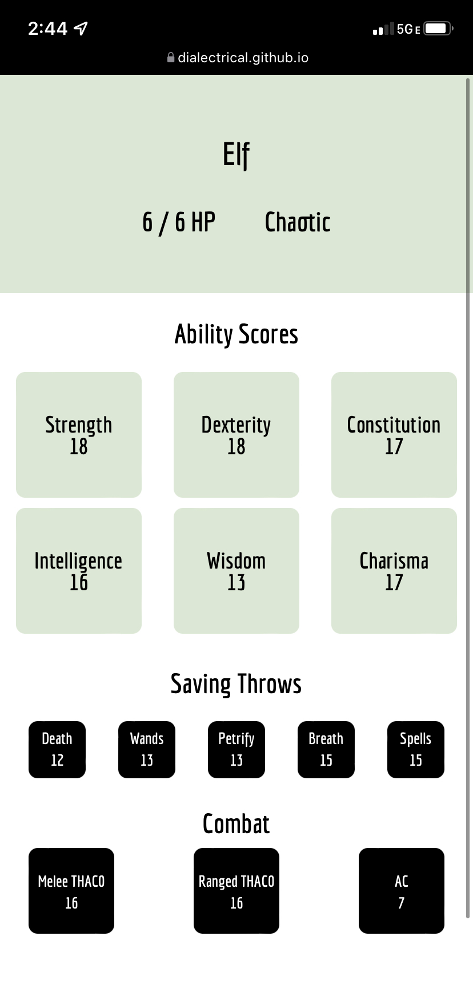

# Old-School Adventure Roleplaying Game Character Generator

This webapp is a character generator for d20-based fantasy adventure and roleplaying games and uses rules from [Old School Essentials](https://oldschoolessentials.necroticgnome.com/srd/index.php/Main_Page). This character generator aims to speed up character creation by automatically rolling up a 1st level character so that you can start playing your game sooner.

You can find the demo [here](). **Note**: the project currently only supports a mobile layout, so consider opening the generator on your phone for the best experience.

## Screenshot!

## Using the Character Generator

When you open the generator, a character will be randomly created for you. If you'd like to generate another character, scroll down and click "Generate." Repeat as many times as necessary!

**Note**: the project currently does not support saving characters. If you generate a character you like, please consider screenshotting or copying down the character!

## How does it work? Can I use it for my game?

This generator is intended for older editions of the popular dungeon-crawling and dragon-fighting roleplaying game and includes only content from the basic rules.

### Included Classes
* Fighter
* Cleric
* Thief
* Magic-user
* Elf
* Halfling
* Dwarf

### Character Generation Process

1. **Generate Ability Scores** - first, the generator generates an array of 6 random numbers to use as ability scores, each between 3 and 18 to simulate rolling 3d6. For each ability score, three sets of random numbers between 3 and 18 are generated and the best score is used for the character's ability score.
2. **Generate Alignment** - next, the character's alignment is randomly determined. Characters can be Chaotic, Lawful, or Neutral.
3. **Select Class** - A class is randomly selected for the character based on the character's abiliy scores and alignemnt. A character with low Intelligence, for example, will not have "Magic-user" selected for them, per the game's rules.
4. **Calculate bonuses and derived statistics** - Finally, with a class selected, the generator calculates any bonuses from ability scores or derived statistics from the chosen class! After this, you're done!

## Planned Updates

I'd like to continue developing and supporting this project in order to make it a helpful play aid for old-school RPGs! Some updates I have planned are:

* Adding a desktop and tablet layout
* Allowing users to save multiple different characters and access them across mulitple sessions (first, through storing characters locally. In the future, I hope to implement cloud storage.)
* Implementing rules for generating characters at levels other than level 1. Ideally, the generator should handle every possible character level!
* Implementing a "play mode," in which the app can be used as a digital character sheet for playing a session, including features like tracking changes to HP, gaining experience points, leveling up, inventory management, and handling dice rolls for combat.
* Adding additional game content, such as additional classes, spell lists, automated inventory management, and more.

## Getting involved

Do you play old-school RPGs? Want to get involved? Drop me an email at michael.camele@gmail.com if you want to chat, or throw an issue up to start a conversation!
